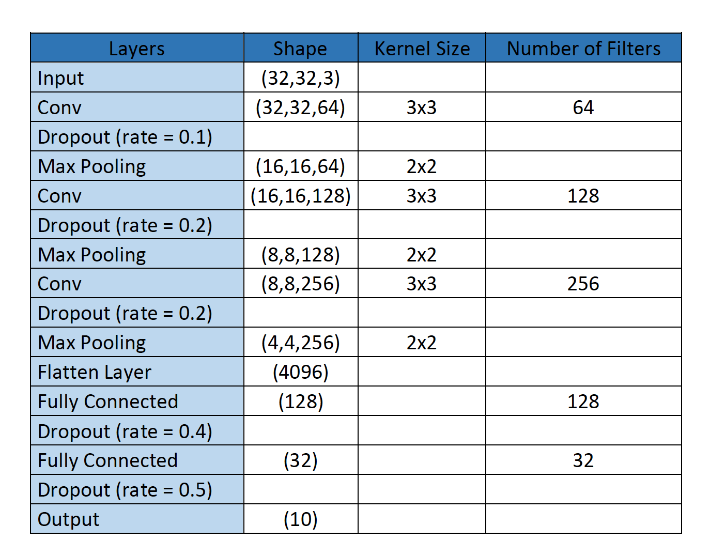
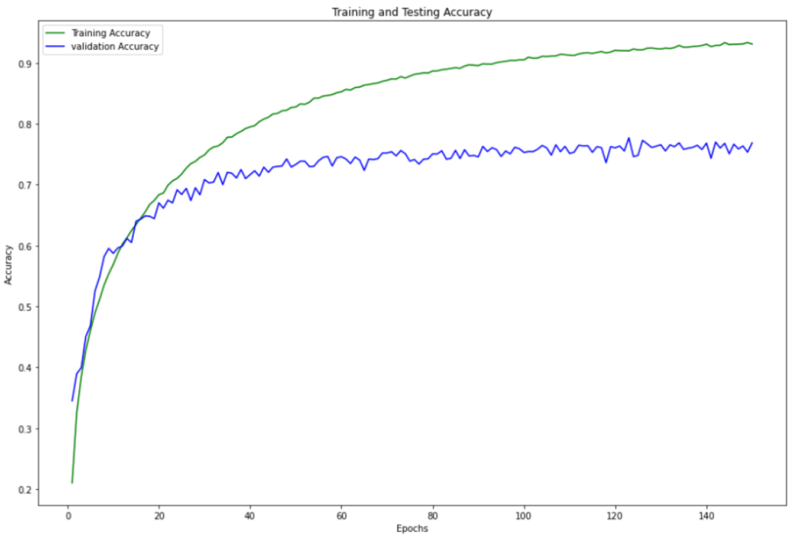
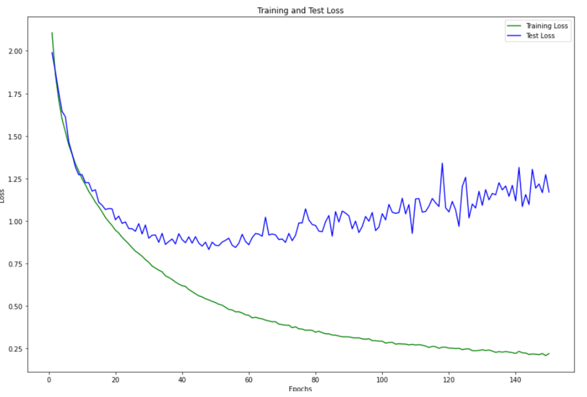
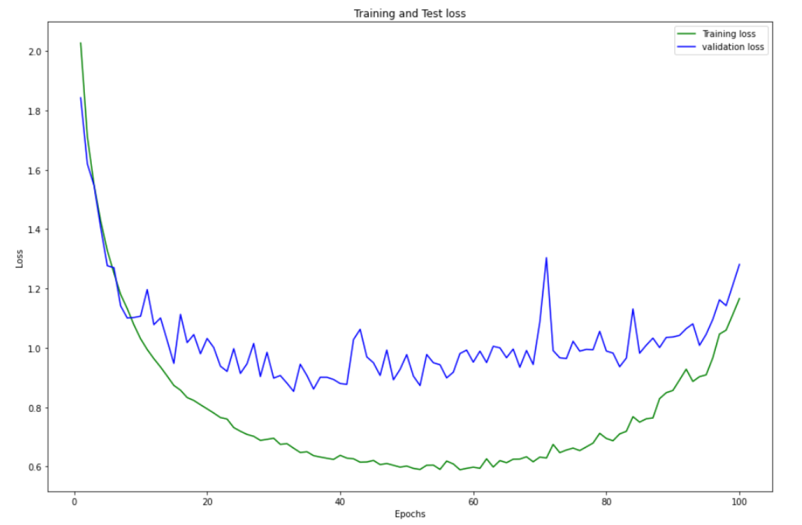
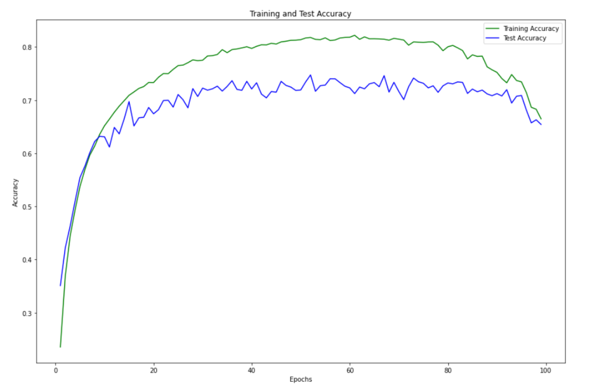

# Project Report

**Problem Definition and Dataset:**  
In this project, we have to build deep learning model with 3 CNN layers for image recognition task on CIFAR10 dataset. CIFAR10 dataset contains 60000 color images in 10 different classes. 50000 of images used for training CNN model, and 10000 of images used for testing. I used TensorFlow 2.x library for creating and testing the CNN model.

* I defined function that apply random flip, random rotate, random zoom, random contrast and random translation operations to images. I tried two types of data augmentation techniques for CIFAR10 dataset. Firstly, I tried to offline data augmentation technique which increase training data size. I picked 10k random images from training data, applied random image operations and concatenated with original training data. Although random images operations added noise to training data, model started to overfit faster because of increased similar images. Secondly, I tried to remove picked images from original training data, I got best result from this technique, I picked 10k images, applied random image operations and concatenate the training data. I also tried this with 20k-30k-40k and 50k images due to increasing noise in the training data, model tended to underfitting.

* According to my researches, generally people recommend 3x3 or 5x5 convolution filter for small size images. After convolution operation, max pooling operation is most used technique so, I tried both 3x3 and 5x5 convolution filter with 2x2 and 3x3 max pooling layer. Number of filters also important parameter for architecture, initial CNN layers capture general features, deeper CNN layers capture more specific features so, I doubled the number of CNN filters and tried two different version of model. Due to the restriction on the number of CNN layers, model have to capture patterns, as much as it can, with 3 CNN layers. Model with 64 filters in the first layer could be better than the other due to restriction. When I tried both models, second one gives better results. I used ReLU activation function, it is most recommended function for deep neural networks.  
• Input →CNN(32) → CNN(64) →CNN(128) → FC(128) → FC(32) → Output  
• Input→ CNN(64)→CNN(128) →CNN (256) → FC (128) → FC(32) →Output

* CNN layers capture the image patterns and create inputs for fully connected layers for classification. After decided to CNN architecture, I tried different size and number of FC layers. We have to find optimum architecture for FC layers because of both overfitting problem and computational cost. Although, computer vision researchers used more and big FC layers for getting better results, I could not increase the number of FC layers due to computational cost.

* The main problem I was dealing with was overfitting, training accuracy reached 98 percent at 10-15 epoch so added dropout layer to avoid overfitting. According to dropout paper, initial layers should have small dropout rates, subsequent layers should have bigger rates. They recommended maximum 0.5 dropout rate for networks, so I added dropout layer in every layer with (after the activation function, before the max pooling operation for CNN layers) 0.1 - 0.2 - 0.2 – 0.4 – 0.5 dropout rates, respectively. It increased model performance on test data.

* I also tried batch normalization in order to avoid overfitting. As stated in batch normalization paper, batch normalization have slight regularization effect for training but it is mainly used for to avoid vanishing/exploding gradients for deeper networks. Because of both restrictions about number of CNN layers and computational cost, we cannot create deeper networks. Batch normalization had little effect on overfitting so I did not use it for my final model.



* I choosed Adam optimizer for training with default 0.0001 learning rate. Number of epochs equal 150.





According to loss and accuracy graphs, model is overfitting after 40-55 epoch. Test loss goes down to 0.87 around in 45-55. epochs.

* I tried SGD optimizer with 0.001 learning rate and 0.5 momentum (100 epoch). When we look at the loss and accuracy graphics below, SGD also started to overfitting at the beginning of the training, after 50 epochs both loss and accuracy started increase. With these parameters, SGD optimizers give close results to Adam optimizers while model does not overfitting but SGD did not converge to minimum loss both train and testing data because of the constant momentum rate.






```python

```
