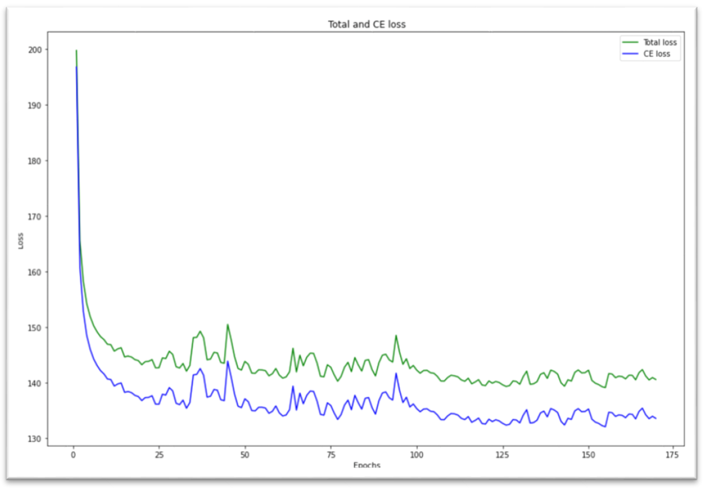
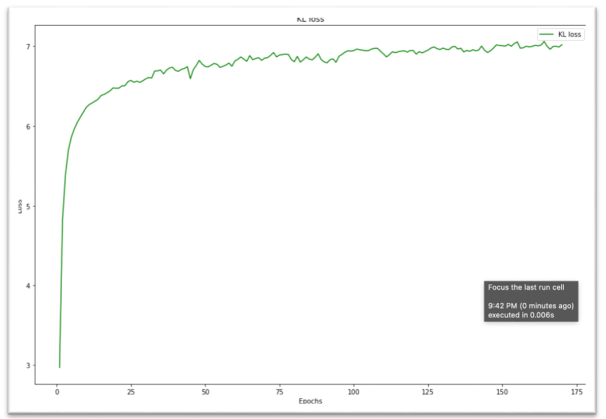
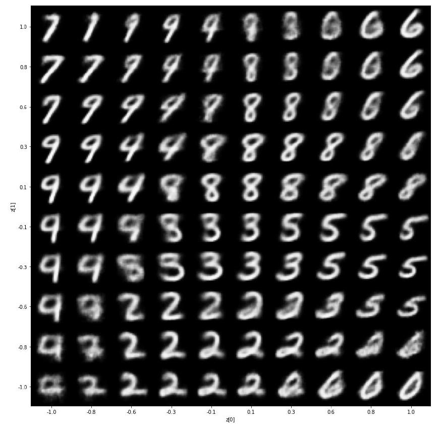
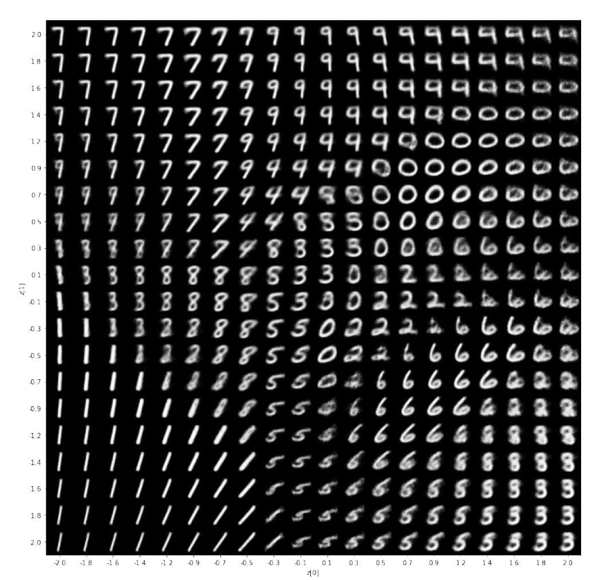

# Project Report

**Problem Definition and Dataset:**  

In this project, we have to build variational autoencoder model which encoder’s consist of LSTM cell and decoder’s consist of convolutional layers with MNIST dataset. MNIST dataset contains 70000 grayscale 28x28 pixels digits images. I used TensorFlow 2.x library for creating variational autoencoder model.

**Network**

 * We have to use LSTM layer for the encoder part of the model. LSTM cells generally used for sequential data but we can feed the network with image data, LSTM cell can treat image data like as sequential data. Each image has 28 rows and 28 columns. LSTM saw this image data, a series of 28 steps with 28 parameters in each step. LSTM cells generate output for each steps but I took only last step’s output so number of hidden units means also LSTM layer output dimension. After LSTM layer, I used one full connected layer. At the end of the decoder, I used two different fully connected layers separately in order to get latent distribution’s mean and variance. I tried different combinations of fully connected layers and LSTM layers that has different number of hidden units.

* Decoder part of the VAE, takes two dimensional input from latent space and regenerate the image. We have to use convolutional layers for image regeneration. I used fully connected layer for first layer of decoder. After the FC layer, 2D transposed convolutional layers upscale the images. Each transposed convolutional layers has 3x3 filter size and 2 pixel strides. At the end of the decoder, last transposed convolutional layer takes 32 filters and create one channel 28x28 pixel digit image.

* We used binary cross entropy loss function with KL-divergence. I used built-in function for binary cross entropy and summed up with KL-divergence loss.

**Training**

* Final VAE model with 170 epochs.





* At the beginning of the training, cross-entropy loss and total loss are almost same and KL-diverge loss is small but while training the model, total loss and cross- entropy loss separating from each other because KL-diverge loss is increasing.

**Generation**



* Although some number are generated beautifully, some similar numbers could not generated well like as 1 and 7, 0 and 9. Generator could not learn well the distribution. I generated 100 and 400 images with different scales.




```python

```
